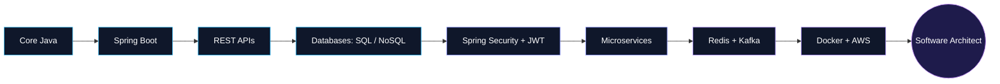

<!--
  =========================================================
  CONFIGURATION — replace each placeholder ONCE using your
  editor's Find & Replace (match case, replace all):

  GITHUB_USERNAME   ->  your GitHub username        (e.g. aditidhoni)
  LINKEDIN_URL      ->  your full LinkedIn profile URL
  EMAIL_ADDRESS     ->  your email address
  LEETCODE_USERNAME ->  your LeetCode username
  =========================================================
-->

<div align="center">


<br/>

<a href="https://git.io/typing-svg">
  
</a>

<br/><br/>

<a href="LINKEDIN_URL" target="_blank">
  
</a>
<a href="mailto:EMAIL_ADDRESS" target="_blank">
  
</a>
<a href="https://github.com/GITHUB_USERNAME" target="_blank">
  
</a>
<a href="https://leetcode.com/LEETCODE_USERNAME" target="_blank">
  
</a>

<br/><br/>


</div>

<br/>


## ⟡ About Me


```java
public class AditiDhoni implements BackendEngineer {

    private String role        = "Backend Developer";
    private String focus       = "Java • Spring Boot • Distributed Systems";
    private String[] techStack = {"Java", "Spring Boot", "MySQL", "PostgreSQL",
                                   "MongoDB", "Docker", "Hibernate", "REST APIs"};
    private String goal        = "Software Architect";

    @Override
    public String currentMission() {
        return "Designing clean, scalable and production-ready backend systems.";
    }
}
```

- 🎯 Backend Developer specializing in **Java** and the **Spring ecosystem**
- 🏗️ Passionate about **System Design**, **Distributed Systems** and **Software Architecture**
- 🌱 Currently deep-diving into **Microservices**, **Spring Security / JWT**, **Redis**, **Kafka** and **AWS**
- 🏆 First Prize — HackSagon Hackathon Open Symposium, IIT Indore
- 🥈 AI For Impact — 7th Rank
- 🎖️ Kriyeta 5.0 — Top 14
- 🤝 Participated in Green Tech (SGSITS) and Prayatna
- 🚀 Long-term goal: becoming an excellent **Backend Engineer**, and eventually a **Software Architect**

<br/>

## ⟡ Current Focus

<div align="center">

| 🧭 Area | 📌 Details |
|:--|:--|
| **Core Development** | Java, Spring Boot, REST API Design |
| **Data Layer** | MySQL, PostgreSQL, MongoDB, Hibernate, JPA |
| **Currently Learning** | Microservices · Spring Security · JWT · Redis · Kafka · AWS |
| **Interests** | System Design · Distributed Systems · Cloud Computing · Open Source |

</div>

<br/>

## ⟡ Tech Stack

<div align="center">

**Languages & Frameworks**


<br/><br/>

**Databases**


<br/><br/>

**DevOps & Tools**


<br/><br/>

**Currently Learning**


</div>

<br/>

## ⟡ Backend Engineering Roadmap

<div align="center">



</div>

<br/>

## ⟡ Featured Projects

<div align="center">

<table>
<tr>
<td width="50%">

### 🔗 URL Shortener
Scalable link-shortening service built with a clean layered architecture.

`Spring Boot` `MySQL` `Docker`


[View Repository →](https://github.com/GITHUB_USERNAME)

</td>
<td width="50%">

### 💰 Expense Tracker API
RESTful API to track, categorize and analyze personal expenses.

`Spring Boot` `REST API` `MySQL`


[View Repository →](https://github.com/GITHUB_USERNAME)

</td>
</tr>
<tr>
<td width="50%">

### 📄 Resume Analyzer
Backend service that parses and analyzes resumes for key insights.

`Java` `Spring Boot` `REST API`


[View Repository →](https://github.com/GITHUB_USERNAME)

</td>
<td width="50%">

### ➕ More Projects
Explore the full collection of backend systems and experiments.

`Java` `Spring` `Databases`


[View All Repositories →](https://github.com/GITHUB_USERNAME?tab=repositories)

</td>
</tr>
</table>

</div>

<br/>

## ⟡ GitHub Analytics

<div align="center">


<br/>


</div>

<div align="center">

### Contribution Graph


</div>

<br/>

<div align="center">

### Trophies


</div>

<br/>

## ⟡ LeetCode Stats

<div align="center">


</div>

<br/>

## ⟡ Contribution Snake

<div align="center">


</div>

<details>
<summary><b>How to enable the snake animation on your own profile</b></summary>
<br/>

1. Create a repository named exactly `GITHUB_USERNAME` (your username) and add this README as `README.md`.
2. In that repository, add the workflow file below at `.github/workflows/snake.yml`.
3. Push to `main` — GitHub Actions will generate the animated SVG automatically on a schedule.

```yaml
name: Generate Snake Animation

on:
  schedule:
    - cron: "0 0 * * *"
  workflow_dispatch:
  push:
    branches:
      - main

jobs:
  generate:
    runs-on: ubuntu-latest
    steps:
      - uses: Platane/snk/svg-only@v3
        with:
          github_user_name: ${{ github.repository_owner }}
          outputs: |
            dist/github-contribution-grid-snake.svg
            dist/github-contribution-grid-snake-dark.svg?palette=github-dark
      - uses: crazy-max/ghaction-github-pages@v4
        with:
          target_branch: output
          build_dir: dist
        env:
          GITHUB_TOKEN: ${{ secrets.GITHUB_TOKEN }}
```

</details>

<br/>

## ⟡ Words to Build By

<div align="center">


</div>

<br/>

## ⟡ Let's Connect

<div align="center">

I'm always open to discussing backend engineering, system design, and interesting open-source collaborations.

<a href="LINKEDIN_URL" target="_blank">
  
</a>
<a href="mailto:EMAIL_ADDRESS" target="_blank">
  
</a>
<a href="https://github.com/GITHUB_USERNAME" target="_blank">
  
</a>

</div>

<br/>


<div align="center">


<sub>Designed & maintained by <b>Aditi Dhoni</b> · Backend Developer</sub>

</div>
